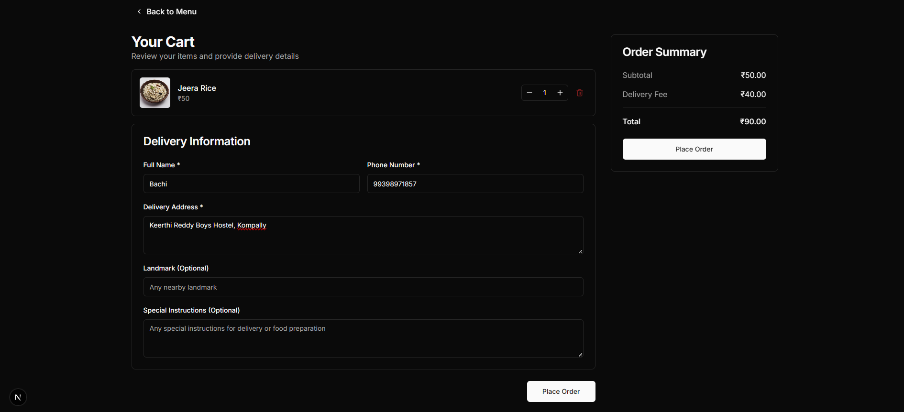
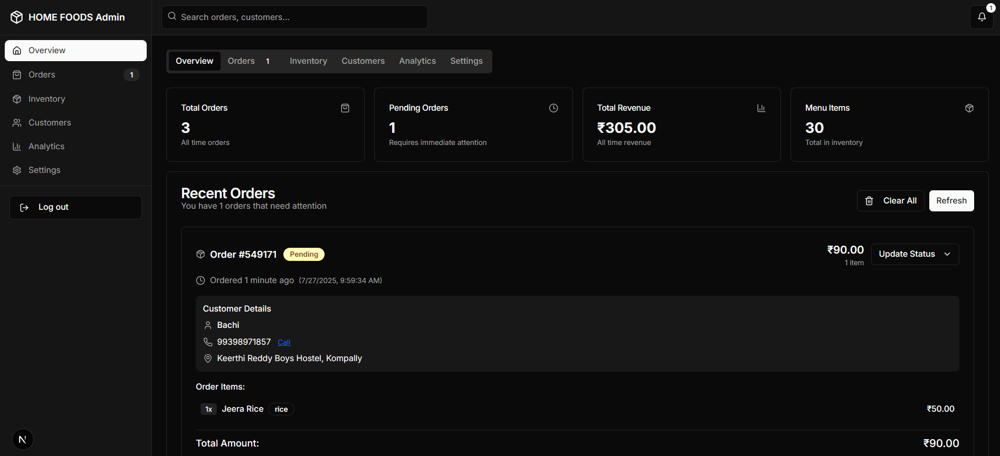

# 🍱 HOME FOODS - Homemade Food Ordering System

**Home Foods** is a web-based application that allows users to browse and order homemade South Indian cuisine. The platform is divided into two parts:
1. **Customer-facing website** for placing orders.
2. **Admin dashboard** for managing orders, menu, inventory, and customers.

🌐 **Live Website**: [https://home-foods.vercel.app/](https://home-foods.vercel.app/)

---

## 🔥 Features

### 👨‍🍳 User Side (Customer Website)
- Browse categorized menu (Idli, Rice, Dosa, Roties).
- Add items to cart with real-time price calculation.
- Enter delivery details and place orders.
- Track order status using Order ID.
- Beautiful, responsive UI with user-friendly experience.

### 🧑‍💼 Admin Side (Admin Dashboard)
- Overview of orders, revenue, and inventory.
- Manage and update order statuses (Pending → Confirmed → Delivered).
- Enable or disable menu items from inventory.
- View customer details for each order.
- Analytics and settings tabs for future enhancements.

---

## 🖼️ Screenshots

### 🏠 Home Page

### 🍽️ Menu Page

### 🛒 Cart and Order Placement

### ✅ Order Confirmation

### 📦 Order Tracking

### 🛠️ Admin Dashboard - Overview

### 📋 Inventory Management

### 📦 Orders Management

---

## 🚀 Source Code
- For Source Code contact: [Shiva](https://shiva003.vercel.app/)

